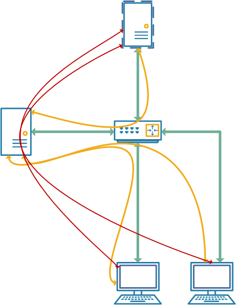
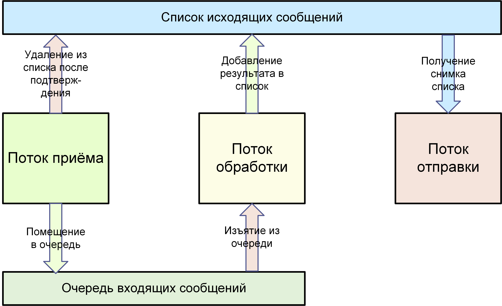

# Море чата

Архитектура системы в общих чертах представляет собой сеть внутри другой сети. Всего в системе 2 уровня, и на каждом уровне есть сервер этого уровня. Итак, существует базовый сервер для работы с протоколами стека IP (в основном с UDP), который развертывает между своими клиентами другую сеть, работающую по собственному серверному протоколу (basic server protocol).
В рамках сети, построенной по протоколу базового сервера, работает сервер сообщений, который отвечает за обслуживание клиентов чата.
Для функционирования системы необходимо создать функционирующую IP-сеть. Вам необходимо запустить базовый сервер в этой сети. Сервер сообщений (один) должен быть подключен к базовому серверу. Каждый клиент чата должен сначала войти в IP-сеть базового сервера, затем подключиться к базовому серверу, а затем войти на сервер сообщений. Кроме того, клиент может использовать доступные функциональные возможности сервера сообщений для обмена данными с другими клиентами.
В целом архитектура показана на рисунке. Зеленые линии на рисунке отражают подключение на уровне IP (в центре - маршрутизатор). Желтые линии представляют связь на уровне протокола базового сервера (на рисунке слева). Изгиб линии отражает путь сообщения на этом уровне, а также "искажение маршрута" из-за характера базового протокола. Таким образом, связь на уровне базового сервера проходит через IP-сеть, но это происходит прозрачно для клиентов базового сервера. Аналогично - для сервера сообщений (красная строка). Красная линия проходит поверх желтой, но на этот раз базовый сервер также прозрачен. На рисунке эта линия представлена в упрощенном виде (чтобы не загромождать диаграмму).

## Общий принцип работы с пакетами

Технологическая схема упаковки показана на рисунке. В случае сервера поток обработки объединяется с потоком отправки. Однако логически это разные части потоковой процедуры (сначала выполняется обработка, затем отправка).

Схема, показанная на рисунке, предназначена для обеспечения доставки пакетов по протоколу UDP.
Проблемы дублирования и смешивания пакетов решаются с помощью поля uid, содержащегося в пакете. В то же время это поле работает по-разному в пакетах для сервера и для клиента.
В случае сервера каждый сеанс каждого пользователя (не более одного сеанса на пользователя) связан с минимально допустимым uid. Если в течение сеанса приходит пакет с идентификатором, меньшим или равным uid, то пакет отбрасывается. Если пакет поступает с большим uid, то пакет принимается, и новый uid записывается в данные сеанса. Этот метод подходит, поскольку у клиентов сервера сообщений нет сценариев, в которых одному клиенту необходимо отправлять несколько пакетов параллельно (то есть, не дожидаясь ответа на получение).
Однако у сервера бывают ситуации, когда он отправляет несколько сообщений параллельно, не дожидаясь ответа от клиента на получение каждого из них. Это происходит, например, когда несколько клиентов пишут сообщения третьему клиенту примерно в одно и то же время. Сервер будет параллельно отправлять сообщения третьему клиенту. Если бы клиент работал точно так же, как сервер, то гарантированно было бы доставлено только последнее сообщение, и хотя предыдущее сообщение получило бы ответ о получении, в действительности его можно было бы просто отбросить, поскольку его минимальный uid меньше ожидаемого.
Чтобы решить эту проблему на клиентах, используется комбинация использования набора принятых uid и минимального uid. Коллекция содержит 256 позиций для хранения uid. Когда количество превышает 256, наименьший из них извлекается из коллекции и устанавливается в качестве минимального uid. Таким образом, реализован гарантированный прием до 256 пакетов, отправляемых сервером параллельно, и этого достаточно, так как базовый сервер имеет ограничение на максимальное количество клиентов - 256 (с адресами от 0 до 255)
